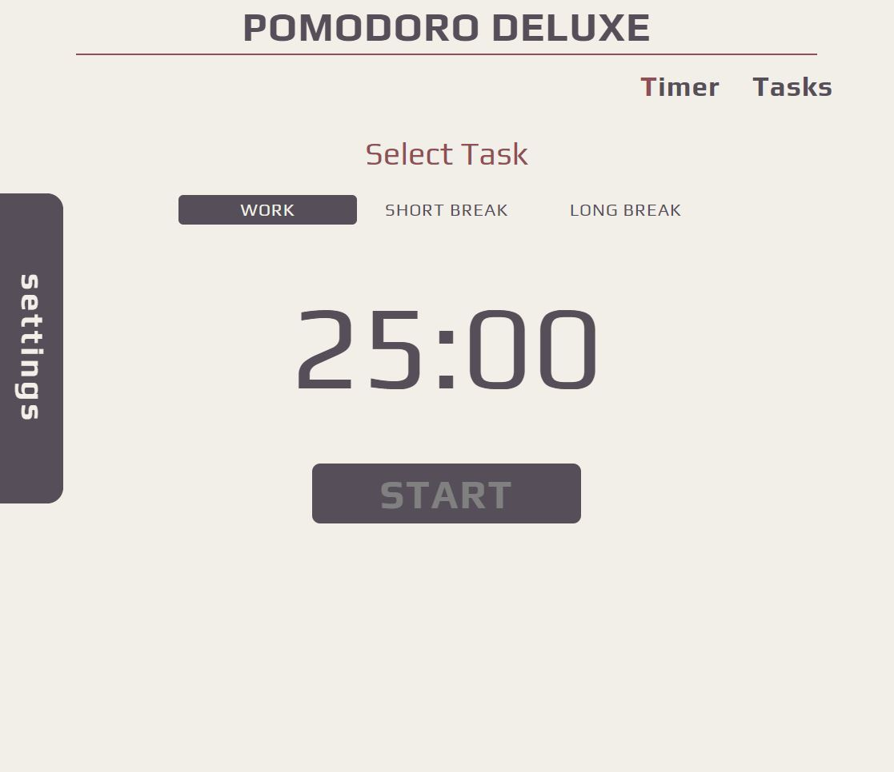

# POMODORO DELUXE



## Introduction

Pomodoro Deluxe is a timer based on the Pomodoro Technique ( created by Francesco Cirillo). The app helps achieve greater work efficiency dividing time into individual work and break intervals. By default, the working time interval is 25min, after each there is a break (long break after every four work intervals). You can use your own settings for intervals.
Click [here](https://mtkuchta.github.io/pomodoro-deluxe/) to use Pomodoro Deluxe.

## How to use Pomodoro Deluxe?

1. Add tasks to work.
2. Select tasks to work on.
3. Start timer and focus on the task.
4. When work interval runs out you will hear an alarm.
5. Taske a break (click Start button to count break time).
6. When the break is over click Start to count next work interval.

## How to change timer settings ?

There is a settings button on the timer page, clicking on it will display the settings tab. The current timer interval is reset when the settings are changed.


## Technologies:
- Node 12.18.4
- React 17.0.1,
- Styled Components 5.2.1
- React Howler 5.0.0,

## Features:

- responsie design (mobile first)
- audio notifiction at the end of a timer interval
- store tasks in local storage
- counting total time spent on the task,
- tasks mofdification,
- timer interval settings,
- information about the current interval,
- information about active task

## Setup

To run this project, install it locally using npm:

```
$ cd ../lorem
$ npm install
$ npm start
```
